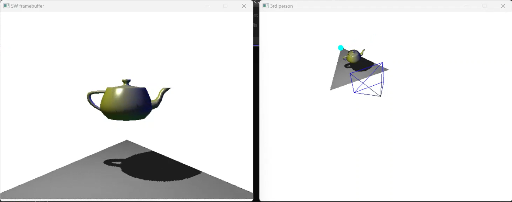
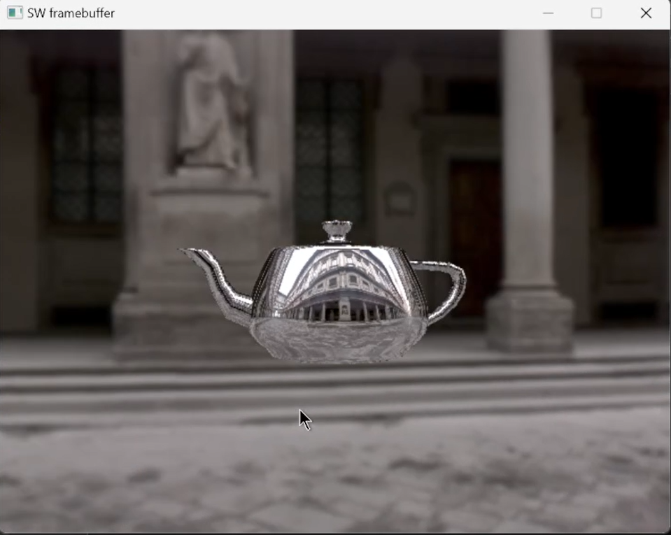

# 3D-graphics-engine
- 3D graphics engine written in C++. 
- Started with a simple framebuffer stored as an array, and worked my way up from rendering lines and triangles to projecting 3D objects with lighting, shadows, textures, and reflections.
- Written as part of CS334 Fundamentals of Computer Graphics.

## Screenshots: 

### Lighting and Shadows: 

### Reflections and Cube Mapping: 

